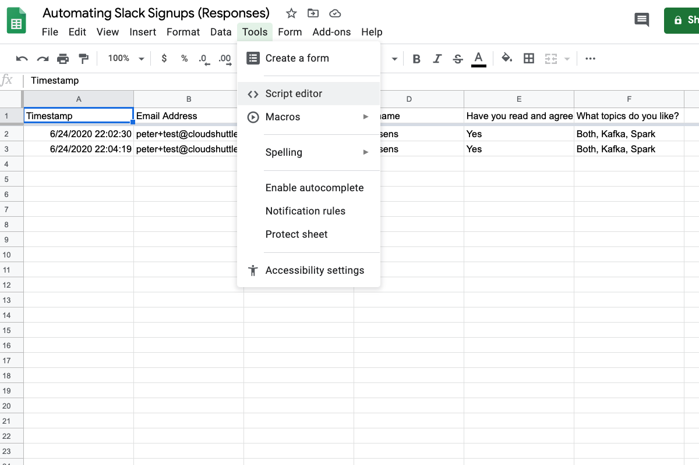

# automating-slack-signups

1. Create a Google Form with the following fields:

- email
- first_name
- last_name
- interests (serverless, data engineering, kafka, spark, map-reduce)
- agree with code of conduct


2. Create a Google Sheets for the responses.



3. Add a macro to the Google Sheets and paste in the provided code.

- paste in the code provided in gsheets-script-editor-code.js
- add your api gw endpoint to it
- click initialise and follow the prompts


4. Create a Mailchimp Audience and do the following:

- get the audience id


- create an email


- create a trigger for the email
- capture the api_key


- add the audience id and api_key to secrets manager


5. Create a Slack Webhook

- create an app called automating-slack-signups
- go to incoming webhooks (under features) and turn them on


- click on the add a new webhook to workspace button
- copy the webhook url and paste it into secrets manager

6. Now you are finally ready to get started with the CDK

- First of all we need to add some python packages to a zip file
- go to the lambda-layers folder and run the following commands

```
python3.7 -m venv .env

source .env/bin/activate

pip install pandas -t ./python

docker build -t lambdalayer:latest .

docker run -it --name lambdalayer lambdalayer:latest bash

deactivate

zip -r python.zip ./python/

mv python.zip ../cdk/layer-code/
```

- this is to be used in a lambda layer, the prefered way of handling packages in the cdk
- deploy the cdk
- open up postman and test
- then test via the form and voila, you're done!